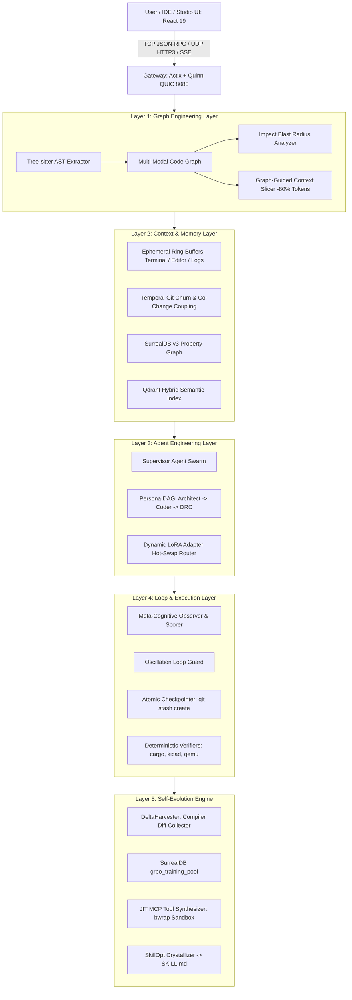

# Oxide-Tech Local Agent OS: System Architecture

**NexusForge / Oxide-Tech-Local-Agent** is organized into 5 primary engineering layers, ensuring full isolation, structural intelligence, deterministic verification, and autonomous self-evolution.

---

## 1. Five-Layer Architecture & Data Flow

---

## 2. Subsystem Deep Dive

### Layer 1: Graph Engineering Layer (`workspace/knowledge`)
- **AST & Call Graph Parser (`ast.rs`)**: Tree-sitter powered parser extracting typed `CodeGraphNode` (Files, Modules, Structs, Traits, Functions, Fields, Variables) and `CodeGraphEdge` (Defines, Calls, Implements, References, DataFlowsTo, Imports).
- **Impact Analysis (`impact_analysis.rs`)**: $K$-hop topological BFS determining downstream breaking blast radiuses, affected files, and recommended test targets.
- **Subgraph Slicer (`subgraph_pruner.rs` & `context_slicer.rs`)**: Extracts minimal 1-hop and 2-hop topological subgraphs as JSON slices to reduce LLM prompt tokens by 75%–89%.

### Layer 2: Context & Memory Layer (`workspace/memory`)
- **Ephemeral Buffers (`ephemeral.rs`)**: Lock-free concurrent ring buffers capturing terminal stream logs, active editor dirty buffers, and panic stack traces.
- **Temporal History (`temporal_git.rs`)**: Analyzes git commit churn rates and file-pair co-change coupling matrices.
- **Dual-State Persistence (`surrealdb-service` & `qdrant-service`)**: SurrealDB v3 property graph schema coupled with high-dimensional Qdrant vector points.

### Layer 3: Agent Engineering Layer (`workspace/router` & `crates/optio`)
- **Multi-Persona Supervisor (`supervisor.rs`)**: Dynamic DAG task decomposition and delegation across personas (`Lead Architect`, `Bare-Metal Firmware Coder`, `EDA Schematic Engineer`, `DRC Reviewer`).
- **Dynamic LoRA Hot-Swapper (`lora_router.rs`)**: Real-time task intent prediction and adapter activation (`lora_embedded_rust_v2`, `lora_kicad_schgen_v3`, `lora_cad_b3d_v1`) via SGLang runtime `/v1/lora/activate`.

### Layer 4: Loop & Execution Layer (`crates/optio` & `workspace/verifier`)
- **Meta-Cognitive Observer (`observer.rs`)**: Evaluates token generation loop efficiency, flags hallucinations, and stops redundant repetitive tool calls.
- **Oscillation Guard (`oscillation.rs`)**: Prevents circular repair loops and infinite retry states.
- **Atomic Checkpointer (`checkpoint.rs`)**: Captures instantaneous working tree states (`git stash create`) and performs instant rollbacks on verification failures.

### Layer 5: Self-Evolution Engine (`crates/self-evolver`)
- **Delta-RL Harvester (`delta_harvester.rs`)**: Computes unified text diffs between failed code and compiler-verified fixes, logging training pairs to `grpo_training_pool` in SurrealDB.
- **JIT MCP Tool Synthesizer (`tool_maker.rs`)**: Generates standalone Python/Mojo tools and tests them inside unshared Linux namespace sandboxes using Bubblewrap (`bwrap`).
- **SkillOpt Workflow Crystallizer (`skill_crystallizer.rs`)**: Distills verified multi-turn execution trajectories into reusable `SKILL.md` workflows under `workspace/skills/`.

---

## 3. Dual-GPU Hardware Offload Architecture

| Device | Role | VRAM Allocation |
|---|---|---|
| **GPU 0 (PCIe 4.0 x16)** | SGLang Tensor Parallel Rank 0 (Qwen3.8-35B), Fast Intent Router (Gemma-4-9B / Ornith-1.0), Mojo SIMD Vector Engine | ~22 GB |
| **GPU 1 (PCIe 4.0 x16)** | SGLang Tensor Parallel Rank 1 (Qwen3.8-35B), Dynamic LoRA Adapter Pool, SF3D / B-Rep Latent Geometry Diffusion Engine | ~22 GB |
