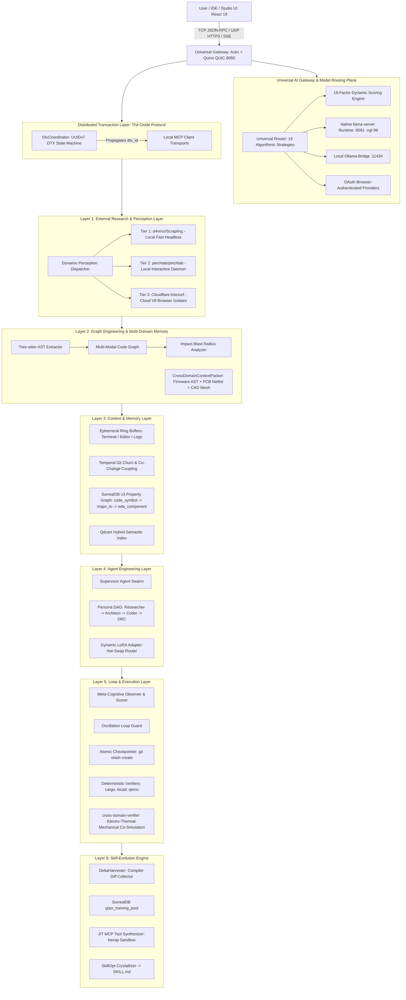

# Oxide-Tech Local Agent OS: System Architecture (v3.2)

**Oxide-Tech-Local-Agent** is organized into isolated, highly optimized engineering layers, ensuring structural intelligence, deterministic verification, autonomous self-evolution, multi-domain physical co-simulation, and universal AI model routing.

---

## 1. System Architecture & Data Flow


```mermaid
graph TD
    Client[User / IDE / Studio UI: React 19] -->|TCP JSON-RPC / UDP HTTP3 / SSE| Gateway[Universal Gateway: Actix + Quinn QUIC 8080]

    subgraph GatewayLayer [Universal AI Gateway & Model Routing Plane]
        Router[Universal Router: 19 Algorithmic Strategies]
        Scorer[16-Factor Dynamic Scoring Engine]
        LlamaRt[Native llama-server Runtime :8081 -ngl 99]
        OllamaRt[Local Ollama Bridge :11434]
        CloudUpstreams[OAuth Browser-Authenticated Providers]
        Router --> Scorer
        Router --> LlamaRt
        Router --> OllamaRt
        Router --> CloudUpstreams
    end

    subgraph DTXLayer [Distributed Transaction Layer: The Oxide Protocol]
        DTX[DtxCoordinator: UUIDv7 DTX State Machine]
        DTX -->|Propagates dtx_id| MCP[Local MCP Client Transports]
    end

    subgraph Layer0 [Layer 1: External Research & Perception Layer]
        PerceptRouter[Dynamic Perception Dispatcher]
        Tier1[Tier 1: d4vinci/Scrapling - Local Fast Headless]
        Tier2[Tier 2: pinchtab/pinchtab - Local Interactive Daemon]
        Tier3[Tier 3: Cloudflare Kitesurf - Cloud V8 Browser Isolates]
        PerceptRouter --> Tier1
        PerceptRouter --> Tier2
        PerceptRouter --> Tier3
    end

    subgraph Layer1 [Layer 2: Graph Engineering & Multi-Domain Memory]
        AST[Tree-sitter AST Extractor] --> NodeGraph[Multi-Modal Code Graph]
        NodeGraph --> Impact[Impact Blast Radius Analyzer]
        Packer[CrossDomainContextPacker: Firmware AST + PCB Netlist + CAD Mesh]
    end

    subgraph Layer2 [Layer 3: Context & Memory Layer]
        RingBuffers[Ephemeral Ring Buffers: Terminal / Editor / Logs]
        TemporalGit[Temporal Git Churn & Co-Change Coupling]
        SurrealGraph[SurrealDB v3 Property Graph: code_symbol -> maps_to -> eda_component]
        QdrantVec[Qdrant Hybrid Semantic Index]
    end

    subgraph Layer3 [Layer 4: Agent Engineering Layer]
        Supervisor[Supervisor Agent Swarm]
        Persona[Persona DAG: Researcher -> Architect -> Coder -> DRC]
        LoRARouter[Dynamic LoRA Adapter Hot-Swap Router]
    end

    subgraph Layer4 [Layer 5: Loop & Execution Layer]
        Observer[Meta-Cognitive Observer & Scorer]
        Oscillation[Oscillation Loop Guard]
        Checkpoint[Atomic Checkpointer: git stash create]
        Verifiers[Deterministic Verifiers: cargo, kicad, qemu]
        CoSim[cross-domain-verifier: Electro-Thermal-Mechanical Co-Simulation]
    end

    subgraph Layer5 [Layer 6: Self-Evolution Engine]
        DeltaHarv[DeltaHarvester: Compiler Diff Collector]
        TrainingPool[SurrealDB grpo_training_pool]
        ToolMaker[JIT MCP Tool Synthesizer: bwrap Sandbox]
        SkillOpt[SkillOpt Crystallizer -> SKILL.md]
    end

    Gateway --> GatewayLayer
    Gateway --> DTXLayer
    DTXLayer --> Layer0
    Layer0 --> Layer1
    Layer1 --> Layer2
    Layer2 --> Layer3
    Layer3 --> Layer4
    Layer4 --> Layer5
```

---

## 2. Universal AI Gateway Matrix (`crates/oxide-gateway/src/universal_router.rs`)

The **Universal AI Gateway** executes a multi-strategy routing plane that load-balances, failovers, and optimizes requests across local hardware and multi-account cloud upstreams:

```text
[ Incoming Request (Prompt / Chat Completion) ]
                     │
                     ▼
        ┌─────────────────────────┐
        │  UniversalRouter        │
        └────────────┬────────────┘
                     │
     ┌───────────────┴───────────────┐
     ▼                               ▼
[ 19 Routing Strategies ]      [ 16-Factor Scoring Engine ]
• priority                     • Context Capacity & Limit Proximity
• fill-first                   • Reasoning / Thinking Support
• weighted / round-robin       • Account Rate Headroom (RPM/RPD)
• p2c / least-used             • 429 Consecutive Failure Exponential Backoff
• cost-optimized / headroom    • KV Cache Affinity / Locality
• reset-window / reset-aware   • Active Token Bucket Balance
• context-relay (>= 85%)       • Offline / Air-gapped Preference
• auto / fusion / chaos        • Historical Provider Latency
                     │
                     ▼
[ Upstream Dispatch: Native llama-server (:8081) / Ollama (:11434) / Cloud ]
```

---

## 3. Non-Autoregressive Pure-Rust Decision Engine (`crates/oxide-engines`)

The decision engine runs **strictly non-autoregressive** (single forward pass, deterministic output, no token-generation loop), achieving ultra-low latency, calibrated confidence, and sub-500 MB footprint:

```text
[ Caller Threads / Rayon Tasks ]
              │
              ▼ (Non-blocking send via Flume MPMC Channel)
    ┌────────────────────────┐
    │     Job Queue          │
    └────────────────────────┘
              │
              ▼ (Dynamic Micro-batching: up to 32 jobs or 2ms timeout)
    ┌──────────────────────────────────┐
    │ Dedicated Worker Thread          │ ──► [Non-Autoregressive Decision]
    │ (CandidateVectorCache / Fast-KAN)│     • Single pooled forward pass
    └──────────────────────────────────┘     • Brier score calibration
              │
              ▼ (Scatter results via oneshot sync channels)
[ Return Result: { selected, confidence, latency } ]
```

### Core Primitives:
- **`DecisionEngine`**: Zero-mutex contention actor-worker handle executing batched matrix multiplications on a dedicated thread.
- **`CandidateVectorCache`**: Pre-computed normalized candidate embeddings for 30–100+ choices, performing microsecond dense dot-product evaluations against state embeddings.
- **`FastKanDecisionHead`**: Non-autoregressive B-spline/trigonometric activation projection resolving multi-candidate probability distributions in a single pass.
- **`BrierScoreLoss`**: Mathematically calibrated loss function avoiding artificial overconfidence.
- **`AlignedTensorMap`**: SIMD-aligned (64-byte boundary) memory-mapped weights with `fs2` advisory reader locks.

---

## 4. Subsystem Deep Dive

### Layer 1: External Research & Perception Layer (`crates/mcp-live-docs`)
- **Stealth Local Extraction (`d4vinci/Scrapling`)**: Fast Python-based extraction worker handling `docs.rs`, GitHub issues, and crates.io with sub-200ms DOM parsing.
- **Local Interactive Browser Daemon (`pinchtab/pinchtab`)**: Lightweight Go daemon delivering accessibility-tree snapshots and Cloak Mode automation.

### Layer 2 & 3: Multi-Domain Graph & Unified Memory (`crates/knowledge` & `crates/memory`)
- **Cross-Domain Topology Mapping**:
  - `code_symbol -> maps_to -> eda_component`
  - `eda_component -> mates_with -> cad_body`
  - `code_function -> constrains -> cad_feature`
- **Cross-Domain Context Packing (`cross_domain_packer.rs`)**: Packs Firmware AST, Electronics Netlists, and 3D CAD feature trees within LLM token budgets.

### Layer 4: Multi-Physics Co-Simulation & Verification (`crates/cross-domain-verifier` & `crates/forge-rust`)
- **Electro-Thermal-Mechanical Loop**:
  1. Computes dynamic MCU wattage from firmware duty cycles.
  2. Evaluates PCB power density across copper layers.
  3. Simulates thermal dissipation over CAD enclosure meshes and material conductivities (Aluminum 6061, PETG, ABS).
  4. Automatically triggers heatsink fin and thermal via generation if silicon junction temperature exceeds $85^\circ\text{C}$.
- **Polyglot Refactoring & Synthesis (`crates/forge-rust`)**:
  - Ingests foreign language codebases (C/C++, Python, TypeScript, Go, Java, Generic).
  - Normalizes syntax into a Polyglot Universal Intermediate Representation (UIR).
  - Refactors memory layouts, error propagation, and concurrency models to safe, idiomatic Rust 2024.
  - Automatically verifies syntax with `syn` and scaffolds complete Cargo workspaces.

### Layer 5 & 6: Distributed Transactions & Self-Evolution (`crates/oxide-protocol` & `crates/self-evolver`)
- **The Oxide Protocol**: Standardized JSON-RPC 2.0 schemas for EDA and 3D CAD tools with time-ordered **UUIDv7 Distributed Transaction IDs (`DtxId`)** and automatic atomic rollbacks (`rollback_dtx`).
- **Self-Evolution Engine**: `DeltaHarvester` and JIT MCP synthesizer running inside unshared `bwrap` namespaces.

### Layer 7: Agent Runtime Safety & Process Supervision (`crates/oxide-security` & `crates/oxide-state`)
- **Circuit Breaker Resource Gater (`resource_gater.rs`)**: Continuous polling of storage and VRAM headroom ($< 2\text{GB}$ freeze / $> 2.5\text{GB}$ resume hysteresis). Rejects incoming HTTP/QUIC requests before OS disk/VRAM exhaustion occurs.
- **Idempotent Session Lifecycle Machine (`session_supervisor.rs`)**: Enforces atomic fsync `SessionReceipt` persistence, request deduplication, and a single crash recovery attempt guarantee.
- **Secure Stderr Capture & Sanitization (`stderr_sanitizer.rs`)**: 16 KiB bounded ring buffer tail capture with regex scrubbing of API keys/tokens into `0600` root-isolated diagnostic files.
- **Process Group Containment (`process_containment.rs`)**: Enforces POSIX process group tree (`setpgid`) wrapping with 4-second SIGTERM grace intervals and SIGKILL tree destruction to eliminate zombie processes.

---

## 5. Desktop-First Monolith Architecture & Controller Facades (`src-tauri`)

The desktop application is engineered as a single-binary hermetic monolith targeting `target/release/oxide-tech-local-agent`. It mounts the full suite of backend capabilities across specialized studio views and in-process controller facades:

### Controller Facade Pattern (`src-tauri/src/controllers/`)
To eliminate IPC sprawl and enforce strict domain boundaries, 18 discrete IPC handler modules are consolidated into 4 domain controllers:
- **`AgentController`**: In-process ReAct loop, model inference routing, and native tool execution.
- **`SystemController`**: Hardware diagnostics (`probe-rs`), Linux udev rules deployment, and TOML profile management.
- **`WorkspaceController`**: `oxide-embed` semantic graph, STAIR Code-ToC leaf search, and Memanto decision conflict auditor.
- **`ForgeController`**: Zero-copy binary reverse engineering, PTX/SASS decompilation, and deterministic verification suites.

### In-Process Native Tool Calling (`crates/oxide-tooling`)
Eliminates out-of-process IPC and HTTP roundtrip penalties for local agent tool execution:
- **`NativeToolRegistry`**: Direct in-memory invocation of core tools (`StairSearchTool`, `MemoryRecallTool`, `HardwareProbeTool`, `PtxDecompileTool`).
- **`OrnithPromptFormatter`**: Produces standard `<tools>` XML schemas and parses `<tool_call>` invocations.

### Verification Horizons (Horizons 0–VII)
- Formal test suite in [`tests/pure_rust_stack_test.rs`](tests/pure_rust_stack_test.rs) verifying GGUF loading, monolith packaging, native tool dispatch, EDA ERC, CAD voxelization, QUIC security, WASI self-evolution, and multi-physics co-simulation.

