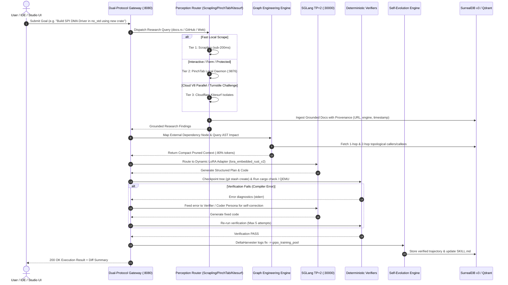
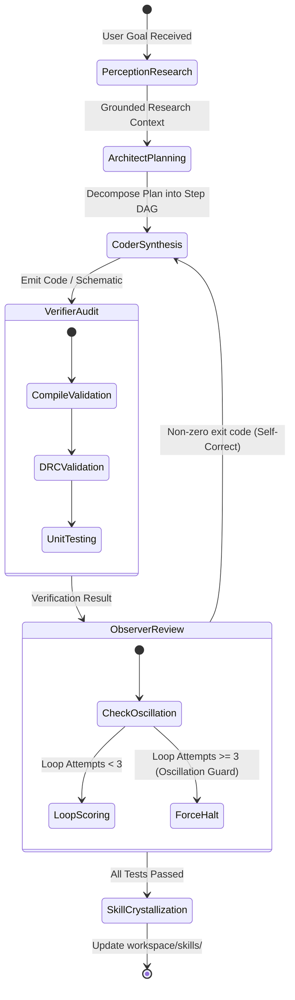
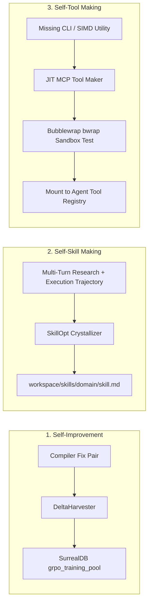

# Oxide-Tech Local Agent OS: System Diagrams (v2.1)

This document contains Mermaid diagrams illustrating request handling, tri-engine perception dispatch, graph traversal, multi-agent loop orchestration, and self-evolution cycles.

---

## 1. End-to-End System Execution Sequence with Perception Layer



---

## 2. Multi-Agent Persona Handoff (Researcher -> Architect -> Coder -> DRC)



---

## 3. Tri-Engine Perception Dispatch Hierarchy

```mermaid
graph TD
    Query[Target URL / Technical Query] --> Dispatcher[Perception Router]

    Dispatcher -->|Static / Docs / GitHub| T1[Tier 1: d4vinci/Scrapling (Local Fast)]
    Dispatcher -->|Interactive / Auth / Local UI| T2[Tier 2: pinchtab/pinchtab (Local Daemon)]
    Dispatcher -->|JS-Heavy / Protected / Visual DRC| T3[Tier 3: Cloudflare Kitesurf (Cloud V8)]

    T1 -->|HTTP 403 / Cloudflare Challenge| T2
    T2 -->|Massive Parallel / Offload| T3

    T1 --> Grounding[Provenance Metadata Tagging]
    T2 --> Grounding
    T3 --> Grounding

    Grounding --> Qdrant[Qdrant Hybrid Vector Store]
    Grounding --> Surreal[SurrealDB v3 Research Cache]
```

---

## 4. Tri-Fold Self-Evolution Engine Flow


