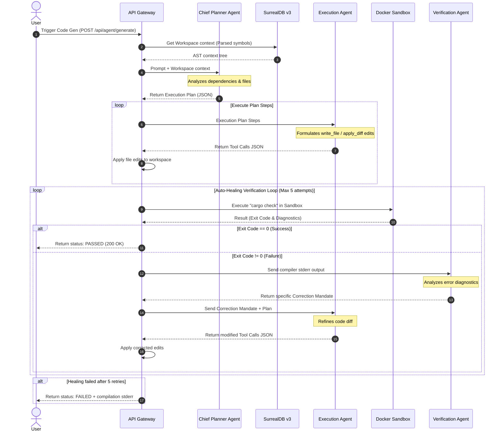
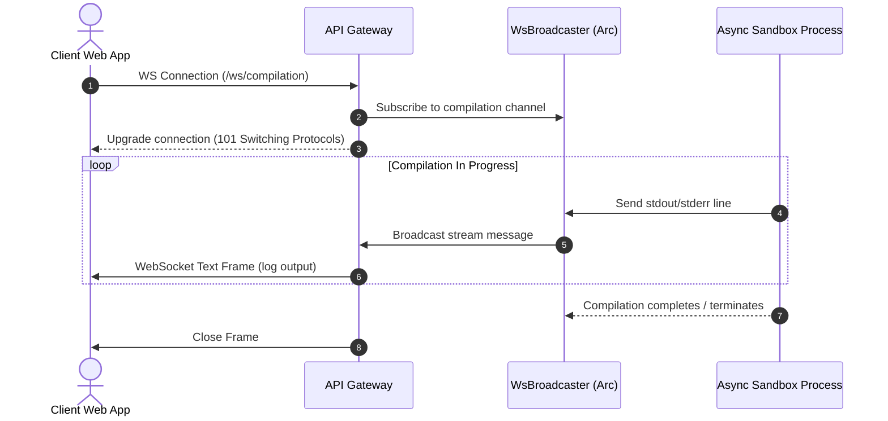

# Oxide-Tech Local Agent OS: System Diagrams

This document contains Mermaid diagrams illustrating the control flow, request handling sequence, and AI agent execution loops inside the platform.

---

## 1. Unified System Request Flow

This diagram illustrates how incoming client requests (both TCP and UDP) are resolved by the dual-protocol gateway and executed inside sandboxes:

```mermaid
sequenceDiagram
    autonumber
    actor Client
    participant Actix as Actix Gateway (TCP:8080)
    participant Quinn as Quinn H3 (UDP:8080)
    participant Core as Rust Core (Services)
    participant DB as SurrealDB v3
    participant Qdrant as Qdrant Vector DB
    participant Docker as Docker Sandbox

    alt TCP Connection (HTTP/1.1 or HTTP/2)
        Client->>Actix: Request (e.g. POST /api/cargo/check)
        Actix->>Core: Decoupled service function call
    else UDP Connection (HTTP/3 - QUIC)
        Client->>Quinn: QUIC Frame (POST /api/cargo/check)
        Quinn->>Core: Decoupled service function call
    end

    alt Database lookup required
        Core->>DB: Query symbol graphs or workspace context
        DB-->>Core: RecordId / SurrealValue data
    else Semantic search required
        Core->>Qdrant: Hybrid dense/sparse search vector
        Qdrant-->>Core: Payload matching datasheet properties
    end

    alt Code or script execution
        Core->>Docker: Execute script inside container limits
        Docker->>Docker: Run cargo / python script
        Docker-->>Core: Exit code, stdout, stderr
    end

    alt TCP Response
        Core-->>Actix: Execution result JSON
        Actix->>Client: 200 OK + [Alt-Svc: h3=":8080"; ma=86400]
    else HTTP/3 Response
        Core-->>Quinn: Execution result JSON
        Quinn->>Client: HTTP/3 Frame (200 OK)
    end
```

---

## 2. Multi-Agent AI Code Generation Loop (Auto-Healing)

The code generation system uses a multi-agent hierarchy consisting of a **Chief Planner**, an **Execution Agent**, and a **Verification Agent** running in an auto-healing feedback loop:



---

## 3. Real-time Log Streaming via WebSockets


