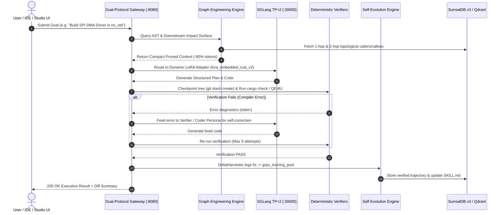
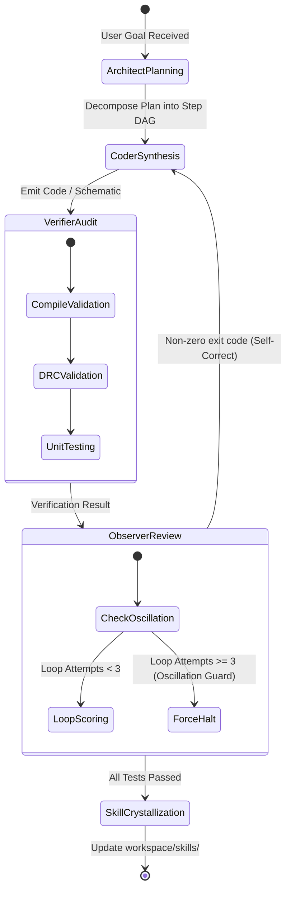
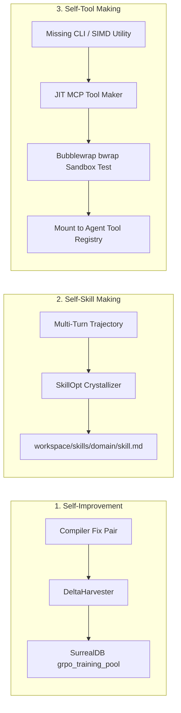

# Oxide-Tech Local Agent OS: System Diagrams

This document contains Mermaid diagrams illustrating request handling, graph traversal, multi-agent loop orchestration, and self-evolution cycles.

---

## 1. End-to-End System Execution Sequence

---

## 2. Multi-Agent Persona Handoff & Oscillation Guard

---

## 3. Tri-Fold Self-Evolution Engine Flow

