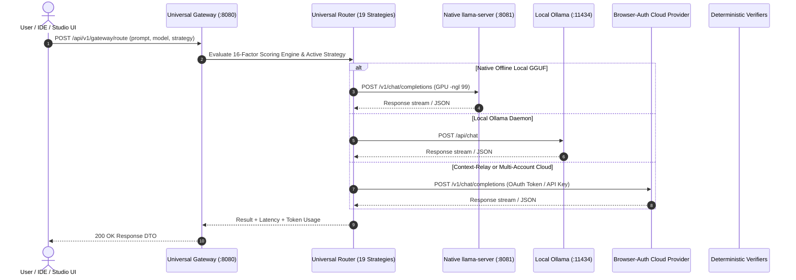
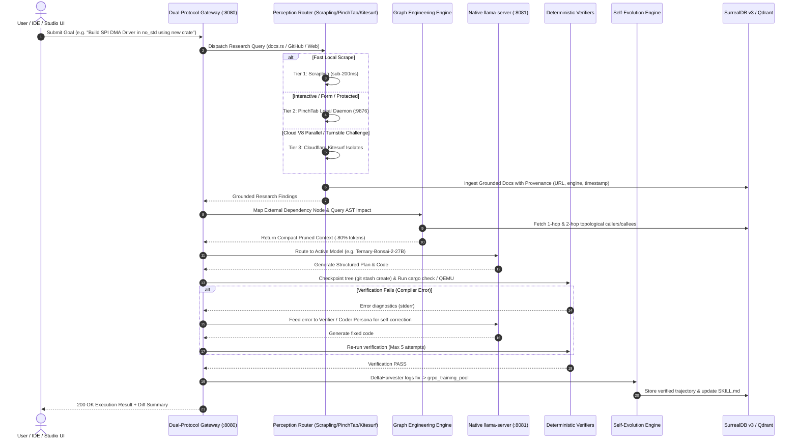
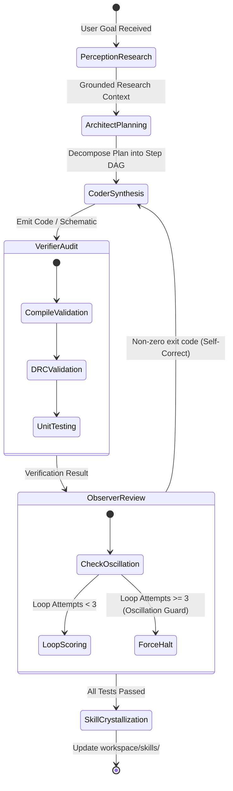
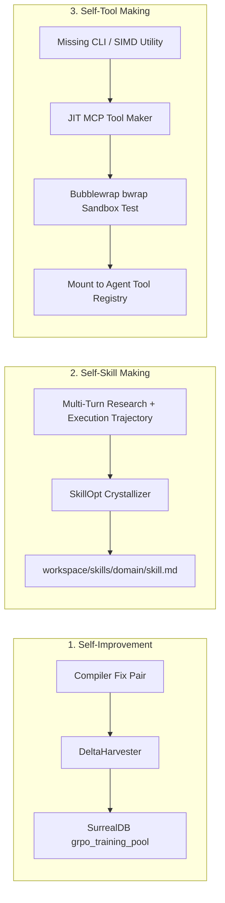
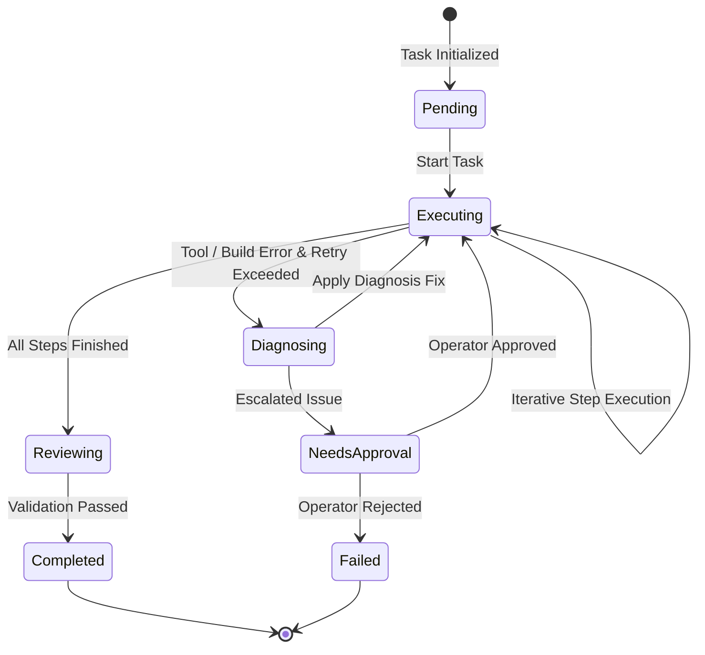
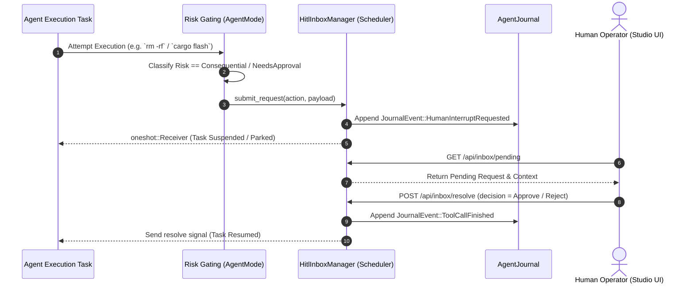

# Oxide-Tech Local Agent OS: System Diagrams (v3.2)

This document contains Mermaid diagrams illustrating request handling, universal AI gateway routing, tri-engine perception dispatch, graph traversal, multi-agent loop orchestration, and self-evolution cycles.

---

## 1. Universal AI Gateway & Native Inference Execution Sequence

```mermaid
sequenceDiagram
    autonumber
    actor User as User / IDE / Studio UI
    participant GW as Universal Gateway (:8080)
    participant Router as Universal Router (19 Strategies)
    participant Llama as Native llama-server (:8081)
    participant Ollama as Local Ollama (:11434)
    participant Cloud as Browser-Auth Cloud Provider
    participant Verifier as Deterministic Verifiers

    User->>GW: POST /api/v1/gateway/route (prompt, model, strategy)
    GW->>Router: Evaluate 16-Factor Scoring Engine & Active Strategy
    alt Native Offline Local GGUF
        Router->>Llama: POST /v1/chat/completions (GPU -ngl 99)
        Llama-->>Router: Response stream / JSON
    else Local Ollama Daemon
        Router->>Ollama: POST /api/chat
        Ollama-->>Router: Response stream / JSON
    else Context-Relay or Multi-Account Cloud
        Router->>Cloud: POST /v1/chat/completions (OAuth Token / API Key)
        Cloud-->>Router: Response stream / JSON
    end
    Router-->>GW: Result + Latency + Token Usage
    GW-->>User: 200 OK Response DTO
```

---

## 2. End-to-End System Execution Sequence with Perception Layer

```mermaid
sequenceDiagram
    autonumber
    actor User as User / IDE / Studio UI
    participant GW as Dual-Protocol Gateway (:8080)
    participant Percept as Perception Router (Scrapling/PinchTab/Kitesurf)
    participant Graph as Graph Engineering Engine
    participant Llama as Native llama-server (:8081)
    participant Verifier as Deterministic Verifiers
    participant Evolver as Self-Evolution Engine
    participant DB as SurrealDB v3 / Qdrant

    User->>GW: Submit Goal (e.g. "Build SPI DMA Driver in no_std using new crate")
    GW->>Percept: Dispatch Research Query (docs.rs / GitHub / Web)
    alt Fast Local Scrape
        Percept->>Percept: Tier 1: Scrapling (sub-200ms)
    else Interactive / Form / Protected
        Percept->>Percept: Tier 2: PinchTab Local Daemon (:9876)
    else Cloud V8 Parallel / Turnstile Challenge
        Percept->>Percept: Tier 3: Cloudflare Kitesurf Isolates
    end
    Percept->>DB: Ingest Grounded Docs with Provenance (URL, engine, timestamp)
    Percept-->>GW: Grounded Research Findings

    GW->>Graph: Map External Dependency Node & Query AST Impact
    Graph->>DB: Fetch 1-hop & 2-hop topological callers/callees
    Graph-->>GW: Return Compact Pruned Context (-80% tokens)

    GW->>Llama: Route to Active Model (e.g. Ternary-Bonsai-2-27B)
    Llama-->>GW: Generate Structured Plan & Code

    GW->>Verifier: Checkpoint tree (git stash create) & Run cargo check / QEMU
    alt Verification Fails (Compiler Error)
        Verifier-->>GW: Error diagnostics (stderr)
        GW->>Llama: Feed error to Verifier / Coder Persona for self-correction
        Llama-->>GW: Generate fixed code
        GW->>Verifier: Re-run verification (Max 5 attempts)
    end

    Verifier-->>GW: Verification PASS
    GW->>Evolver: DeltaHarvester logs fix -> grpo_training_pool
    Evolver->>DB: Store verified trajectory & update SKILL.md
    GW-->>User: 200 OK Execution Result + Diff Summary
```

---

## 3. Multi-Agent Persona Handoff (Researcher -> Architect -> Coder -> DRC)

```mermaid
stateDiagram-v2
    [*] --> PerceptionResearch : User Goal Received
    PerceptionResearch --> ArchitectPlanning : Grounded Research Context
    ArchitectPlanning --> CoderSynthesis : Decompose Plan into Step DAG
    CoderSynthesis --> VerifierAudit : Emit Code / Schematic

    state VerifierAudit {
        [*] --> CompileValidation
        CompileValidation --> DRCValidation
        DRCValidation --> UnitTesting
    }

    VerifierAudit --> ObserverReview : Verification Result
    
    state ObserverReview {
        [*] --> CheckOscillation
        CheckOscillation --> LoopScoring : Loop Attempts < 3
        CheckOscillation --> ForceHalt : Loop Attempts >= 3 (Oscillation Guard)
    }

    ObserverReview --> CoderSynthesis : Non-zero exit code (Self-Correct)
    ObserverReview --> SkillCrystallization : All Tests Passed
    SkillCrystallization --> [*] : Update workspace/skills/
```

---

## 4. Tri-Engine Perception Dispatch Hierarchy

```mermaid
graph TD
    Query[Target URL / Technical Query] --> Dispatcher[Perception Router]

    Dispatcher -->|Static / Docs / GitHub| T1[Tier 1: d4vinci/Scrapling (Local Fast)]
    Dispatcher -->|Interactive / Auth / Local UI| T2[Tier 2: pinchtab/pinchtab (Local Daemon)]
    Dispatcher -->|JS-Heavy / Protected / Visual DRC| T3[Tier 3: Cloudflare Kitesurf (Cloud V8)]

    T1 -->|HTTP 403 / Cloudflare Challenge| T2
    T2 -->|Massive Parallel / Offload| T3

    T1 --> Grounding[Provenance Metadata Tagging]
    T2 --> Grounding
    T3 --> Grounding

    Grounding --> Qdrant[Qdrant Hybrid Vector Store]
    Grounding --> Surreal[SurrealDB v3 Research Cache]
```

---

## 5. Tri-Fold Self-Evolution Engine Flow

```mermaid
graph LR
    subgraph SelfImprovement [1. Self-Improvement]
        Fix[Compiler Fix Pair] --> Delta[DeltaHarvester]
        Delta --> Training[SurrealDB grpo_training_pool]
    end

    subgraph SelfSkillMaking [2. Self-Skill Making]
        Traj[Multi-Turn Research + Execution Trajectory] --> Crystallizer[SkillOpt Crystallizer]
        Crystallizer --> SkillMD[workspace/skills/domain/skill.md]
    end

    subgraph SelfToolMaking [3. Self-Tool Making]
        Missing[Missing CLI / SIMD Utility] --> ToolMaker[JIT MCP Tool Maker]
        ToolMaker --> Bwrap[Bubblewrap bwrap Sandbox Test]
        Bwrap --> Mounted[Mount to Agent Tool Registry]
    end
```

---

## 6. Cyclic Agent FSM Lifecycle & State Transitions

```mermaid
stateDiagram-v2
    [*] --> Pending : Task Initialized
    Pending --> Executing : Start Task
    Executing --> Executing : Iterative Step Execution
    Executing --> Diagnosing : Tool / Build Error & Retry Exceeded
    Executing --> Reviewing : All Steps Finished
    Diagnosing --> Executing : Apply Diagnosis Fix
    Diagnosing --> NeedsApproval : Escalated Issue
    NeedsApproval --> Executing : Operator Approved
    NeedsApproval --> Failed : Operator Rejected
    Reviewing --> Completed : Validation Passed
    Completed --> [*]
    Failed --> [*]
```

---

## 7. Human-in-the-Loop (HITL) Inbox Suspension & Resumption Sequence

```mermaid
sequenceDiagram
    autonumber
    participant Agent as Agent Execution Task
    participant Guard as Risk Gating (AgentMode)
    participant Inbox as HitlInboxManager (Scheduler)
    participant Journal as AgentJournal
    actor Human as Human Operator (Studio UI)

    Agent->>Guard: Attempt Execution (e.g. `rm -rf` / `cargo flash`)
    Guard->>Guard: Classify Risk == Consequential / NeedsApproval
    Guard->>Inbox: submit_request(action, payload)
    Inbox->>Journal: Append JournalEvent::HumanInterruptRequested
    Inbox-->>Agent: oneshot::Receiver (Task Suspended / Parked)

    Human->>Inbox: GET /api/inbox/pending
    Inbox-->>Human: Return Pending Request & Context
    Human->>Inbox: POST /api/inbox/resolve (decision = Approve / Reject)
    Inbox->>Journal: Append JournalEvent::ToolCallFinished
    Inbox-->>Agent: Send resolve signal (Task Resumed)
```
