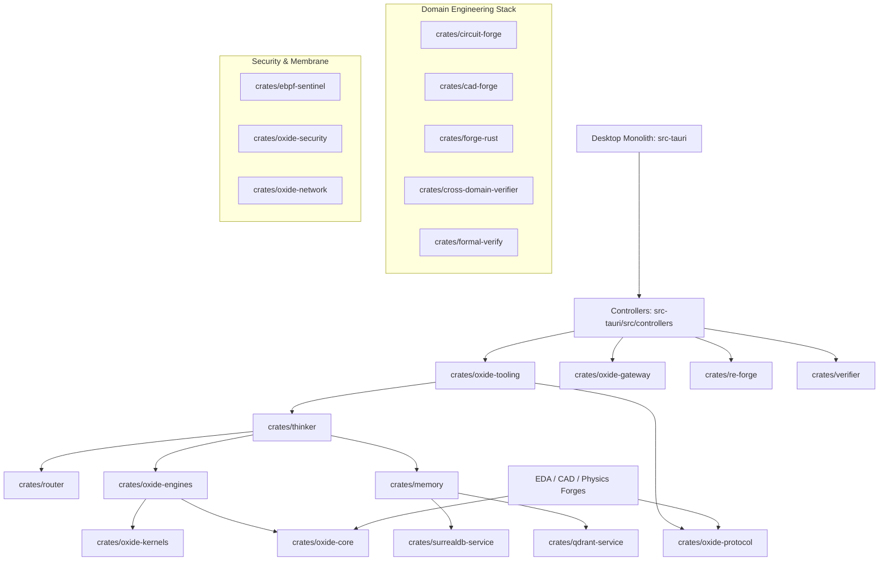

# Crate Topology & Interface Contracts

This document specifies the architectural boundaries, dependency DAG, and public interface contracts across all crates in the **Oxide-Tech Local Agent OS** workspace.

---

## 1. Workspace Dependency Hierarchy (Layered DAG)

The workspace strictly enforces a downward-only dependency hierarchy. Cyclical dependencies between crates are prohibited.

---

## 2. Core Crate Catalog & Interface Contracts

### Tier 0: Fundamental Substrate & Protocols

#### [`crates/oxide-core`](file:///home/jrad/RustroverProjects/Oxide-Tech-Local-Agent/crates/oxide-core)
- **Role**: Foundational types, token channels, FFI safety boundaries, unified diff patching, and sealed shared memory.
- **Key Types**:
  - `diff_patcher::UnifiedDiffPatcher`: Applies unified diffs with fuzzy line-offset resolution and fallback rejection.
  - `channel::TokenChannel`: Zero-allocation bounded token streaming channel for real-time model inference.
  - `ffi_boundary::call_ffi_safe`: Catches panics across native FFI boundaries and normalizes into structured `Result<T, FfiError>`.
  - `shm::SealedSharedMemory`: Memory-mapped POSIX shared memory buffers with write-once sealing.

#### [`crates/oxide-protocol`](file:///home/jrad/RustroverProjects/Oxide-Tech-Local-Agent/crates/oxide-protocol)
- **Role**: Universal communication schemas, JSON-RPC 2.0 payloads for EDA/CAD, and time-ordered distributed transaction management.
- **Key Types**:
  - `DtxId`: Time-ordered UUIDv7 distributed transaction identifier (`DtxId::new_v7()`).
  - `DtxMessage`: Transaction envelope specifying domain target (`Firmware`, `Eda`, `Cad`, `Physics`), action payload, and rollback steps.
  - `JsonRpcRequest` / `JsonRpcResponse`: Typed RPC contracts with zero-copy deserialization.

#### [`crates/oxide-kernels`](file:///home/jrad/RustroverProjects/Oxide-Tech-Local-Agent/crates/oxide-kernels)
- **Role**: Native CPU SIMD (AVX-512, NEON) and GPU tensor kernels, autotuning, and quantization.
- **Key Types**:
  - `ternary::ternary_bitplane_xnor_gemm`: 1.58-bit ternary matrix multiplication (-1, 0, +1) using XNOR and bit-count popcount.
  - `norm::rmsnorm_forward`: Fused RMSNorm with optional residual addition.
  - `rope::apply_rope`: Rotary Position Embedding with trigonometric frequency caching.
  - `moe_router::fused_moe_router`: Top-K expert selection routing kernel with sub-10ms latency guarantee.

---

### Tier 1: Infrastructure, Storage & Security

#### [`crates/oxide-network`](file:///home/jrad/RustroverProjects/Oxide-Tech-Local-Agent/crates/oxide-network)
- **Role**: Sovereign QUIC mesh transport, packet anti-replay, and anti-DPI firewalls.
- **Key Types**:
  - `wire::ReplayWindow128`: 128-packet sliding-window bitmap tracking sequence numbers to prevent replay attacks.
  - `wire::pre_parse_junk_frame_filter`: Detects DPI junk headers (`0xDEADBEEF`, HTTP signatures) and returns `PreParseVerdict::JunkIgnored`.
  - `wire::PacketHeader`: Strict 16-byte binary wire frame header.
  - `crypto::AeadCipher`: XChaCha20-Poly1305 symmetric authenticated encryption.

#### [`crates/oxide-security`](file:///home/jrad/RustroverProjects/Oxide-Tech-Local-Agent/crates/oxide-security)
- **Role**: Resource gaters, process isolation, and audit receipt generation.
- **Key Types**:
  - `resource_gater::ResourceGater`: Circuit breaker freezing operations when storage or VRAM drops below 2 GB.
  - `process_containment::ProcessGroup`: POSIX process tree confinement (`setpgid`) with 4-second SIGTERM grace periods.
  - `session_supervisor::SessionReceipt`: Cryptographically signed, idempotent execution receipts.

#### [`crates/surrealdb-service`](file:///home/jrad/RustroverProjects/Oxide-Tech-Local-Agent/crates/surrealdb-service) & [`crates/qdrant-service`](file:///home/jrad/RustroverProjects/Oxide-Tech-Local-Agent/crates/qdrant-service)
- **Role**: Multi-model property graph and vector database management for persistent memory and AST reasoning.
- **Invariants**:
  - Embedded SurrealKV runs locally with zero external network daemon dependencies.
  - Qdrant runs embedded with 1024-dimensional cosine index for semantic AST retrieval.

---

### Tier 2: AI Engines, Gateway & Tooling

#### [`crates/oxide-engines`](file:///home/jrad/RustroverProjects/Oxide-Tech-Local-Agent/crates/oxide-engines)
- **Role**: Pure-Rust non-autoregressive decision engine and GGUF memory-mapped execution.
- **Key Types**:
  - `DecisionEngine`: Actor-worker handling candidate scoring via non-blocking Flume MPMC queues.
  - `FastKanDecisionHead`: Kolmogorov-Arnold Network projection head for single-pass multi-candidate routing.
  - `mmap_tensor::AlignedTensorMap`: SIMD 64-byte aligned memory-mapped tensor storage with `fs2` advisory reader locks.

#### [`crates/oxide-tooling`](file:///home/jrad/RustroverProjects/Oxide-Tech-Local-Agent/crates/oxide-tooling)
- **Role**: In-process native tool execution and prompt XML serialization.
- **Key Types**:
  - `native_tools::NativeTool`: Trait implemented by zero-IPC native tools (`name`, `description`, `parameters_schema`, `execute`).
  - `native_tools::NativeToolRegistry`: In-memory thread-safe registry dispatching tool calls directly inside the process.
  - `native_tools::OrnithPromptFormatter`: Generates `<tools>` XML schemas and parses `<tool_call>` responses.

#### [`crates/oxide-gateway`](file:///home/jrad/RustroverProjects/Oxide-Tech-Local-Agent/crates/oxide-gateway)
- **Role**: Universal AI gateway with 19 routing strategies, 16-factor scoring, and proxying to local engines or cloud accounts.
- **Key Types**:
  - `universal_router::UniversalRouter`: Dispatches requests using strategies like `cost-optimized`, `context-relay`, `p2c`, and `auto`.
  - `routes`: OpenAI-compatible `/v1/chat/completions` and `/api/v1/gateway/route` endpoints.

---

### Tier 3: Domain Engineering Forges & Verification

#### [`crates/circuit-forge`](file:///home/jrad/RustroverProjects/Oxide-Tech-Local-Agent/crates/circuit-forge)
- **Role**: Open-source EDA schematic generation, netlists, and Electrical Rule Checking (ERC).
- **Key Types**:
  - `CircuitBuilder`: Fluent API constructing multi-component circuit graphs.
  - `CircuitGraph`: Directed netlist representation of components and interconnects.
  - `erc::ErcRunner`: Checks floating nets, missing decoupling capacitors (IPC-2152), and current density.

#### [`crates/cad-forge`](file:///home/jrad/RustroverProjects/Oxide-Tech-Local-Agent/crates/cad-forge)
- **Role**: Parametric 3D CAD modeling, B-Rep geometry, and volumetric voxel collision.
- **Key Types**:
  - `CadBuilder`: CSG modeling engine performing boolean union, difference, and intersection.
  - `voxel::VoxelGrid`: 3D occupancy grid for fast IoU calculation and physical enclosure clearance verification.

#### [`crates/cross-domain-verifier`](file:///home/jrad/RustroverProjects/Oxide-Tech-Local-Agent/crates/cross-domain-verifier)
- **Role**: Electro-thermal-mechanical multi-physics co-simulation loop.
- **Key Types**:
  - `CoSimOrchestrator`: Runs fixed-point iteration between firmware duty cycle, PCB copper heating, and CAD heat dissipation.
  - `mcu_spice_bridge::McuSpiceBridge`: Bridges digital MCU GPIO events with SPICE analog transient analysis.

#### [`crates/formal-verify`](file:///home/jrad/RustroverProjects/Oxide-Tech-Local-Agent/crates/formal-verify)
- **Role**: SMT-LIB2 invariant proof generation and Kani bounded model checking harnesses.
- **Key Types**:
  - `hardware_rules::PushPullContentionValidator`: SMT solver ensuring no two active outputs drive a shared bus simultaneously.
  - `trace_validator::TraceValidator`: Validates firmware execution traces against real-time deadline schedules.

---

### Tier 4: Desktop Application & Controller Facades

#### [`src-tauri`](file:///home/jrad/RustroverProjects/Oxide-Tech-Local-Agent/src-tauri)
- **Role**: Single production desktop monolith executable (`oxide-tech-local-agent`).
- **Key Modules**:
  - `src/controllers/agent_controller.rs`: In-process reasoning, native tool calling, and prompt synthesis.
  - `src/controllers/system_controller.rs`: Hardware probe, diagnostics, and config.
  - `src/controllers/workspace_controller.rs`: STAIR Code-ToC leaf search and Memanto memory graph.
  - `src/controllers/forge_controller.rs`: Zero-copy binary reverse engineering and verifiers.
  - `src/main.rs`: Entry point registering IPC commands and headless CLI subcommands (`desktop`, `daemon`, `doctor`, `re-forge`, `verify`, `memory`).
