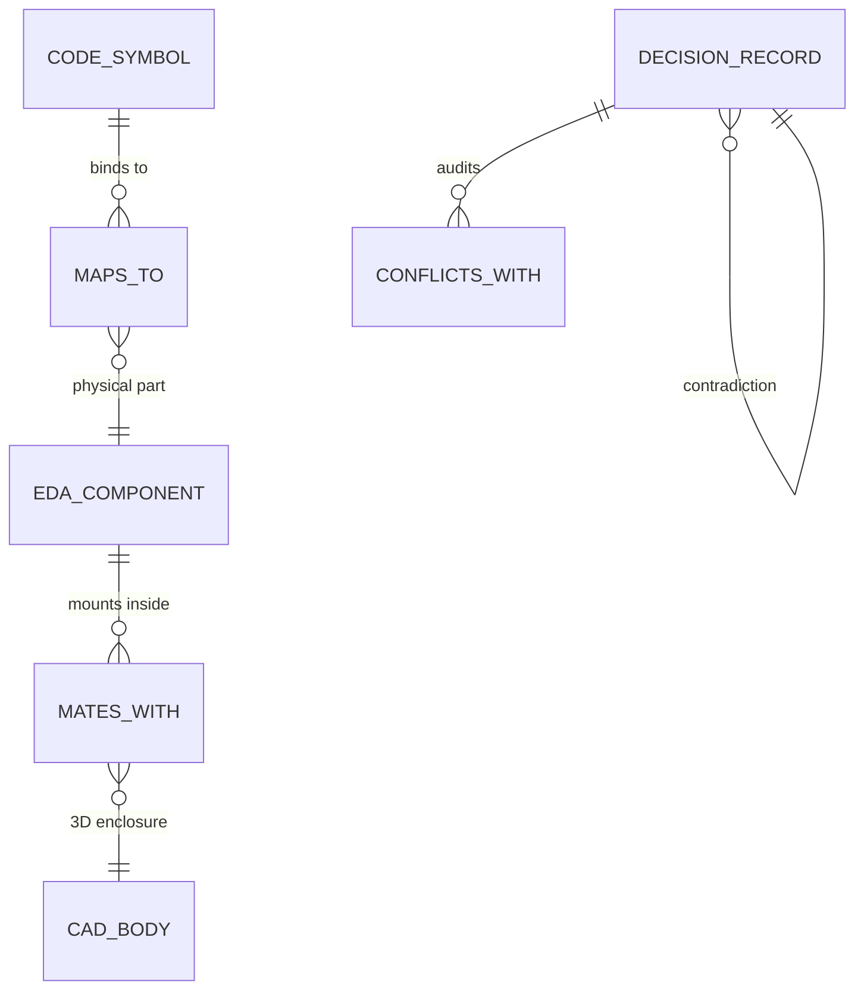

# Memory Fabric, Graph Schema & STAIR Search Specification

This document specifies the multi-model property graph schema (SurrealDB v3), dense vector collection topology (Qdrant), and the STAIR Code-ToC leaf search engine implemented in [`crates/memory`](file:///home/jrad/RustroverProjects/Oxide-Tech-Local-Agent/crates/memory), [`crates/surrealdb-service`](file:///home/jrad/RustroverProjects/Oxide-Tech-Local-Agent/crates/surrealdb-service), and `oxide-embed`.

---

## 1. Multi-Tiered Memory Architecture

Memory in Oxide-Tech is partitioned into four distinct temporal tiers to balance real-time execution speed with persistent architectural grounding:

| Tier | Substrate | Retention | Primary Function |
| :--- | :--- | :--- | :--- |
| **Tier 0: Ephemeral Ring Buffers** | RAM (`RingBuffer<T>`) | Current Task | Compiler diagnostics, terminal lines, and token streams. |
| **Tier 1: Scoped Working Memory** | SurrealKV (In-Memory) | Active Session | Multi-turn chat context, pending diff hunks, and persona states. |
| **Tier 2: GraphRAG Property Graph** | SurrealDB v3 Engine | Permanent | AST nodes, EDA schematic symbols, CAD bodies, and relations. |
| **Tier 3: Semantic Vector Index** | Qdrant Client | Permanent | 1024-dimensional dense symbol and chunk embeddings. |

---

## 2. SurrealDB v3 Property Graph Schema

The property graph captures multi-domain linkages across software, electronics, and mechanical models:



### Table Definitions:

```surrealql
-- Code symbol extracted via Tree-sitter
DEFINE TABLE code_symbol SCHEMALESS;
DEFINE INDEX symbol_name_idx ON TABLE code_symbol COLUMNS name;
DEFINE INDEX symbol_file_idx ON TABLE code_symbol COLUMNS file_path;

-- EDA physical schematic component
DEFINE TABLE eda_component SCHEMALESS;
DEFINE INDEX comp_ref_idx ON TABLE eda_component COLUMNS ref_des;

-- Mechanical CAD 3D solid or boundary representation
DEFINE TABLE cad_body SCHEMALESS;
DEFINE INDEX body_id_idx ON TABLE cad_body COLUMNS body_id;

-- Architectural decision record (Memanto)
DEFINE TABLE decision_record SCHEMALESS;
DEFINE INDEX decision_kind_idx ON TABLE decision_record COLUMNS kind;

-- Relationships
DEFINE TABLE maps_to SCHEMALESS;
DEFINE TABLE mates_with SCHEMALESS;
DEFINE TABLE constrains SCHEMALESS;
DEFINE TABLE conflicts_with SCHEMALESS;
```

---

## 3. Qdrant Dense Vector Collection

Semantic vector retrieval operates over local 1024-dimensional embeddings (generated by `qwen3-embedding-0.6b` or `FastEmbed`):

- **Collection Name**: `oxide_code_chunks`
- **Vector Dimension**: `1024`
- **Distance Metric**: `Cosine`
- **Payload Schema**:
  ```json
  {
    "file_path": "crates/oxide-kernels/src/ternary.rs",
    "symbol_name": "ternary_bitplane_xnor_gemm",
    "symbol_kind": "function",
    "start_line": 42,
    "end_line": 98,
    "docstring": "1.58-bit ternary matrix multiplication using bitplane XNOR and popcount.",
    "workspace_relative": true
  }
  ```

---

## 4. STAIR Code-ToC Leaf Search

Standard RAG techniques dump oversized raw code chunks into LLM contexts, causing semantic bleeding and token exhaustion. Oxide-Tech employs **STAIR (Structural Table-of-Contents AST Indexed Retrieval)**:

### Search Mechanics:
1. **Tree-Sitter Symbol Extraction**: Parses the codebase into precise semantic nodes (structs, traits, functions, modules).
2. **Hierarchical Breadcrumb Routing**: Generates strict structural paths leading to target definitions:
   ```text
   [crates/oxide-kernels] -> [ternary.rs] -> [impl BitplaneTernary] -> [ternary_bitplane_xnor_gemm]
   ```
3. **Surgical Symbol Slicing**: When retrieving a symbol, STAIR extracts only the target function and its immediate type signature, omitting surrounding unrelated code.
4. **Knapsack Context Packing**: Stacks retrieved symbols within a fixed budget (e.g. 1500 tokens), maximizing information density without overflowing attention windows.

---

## 5. Memanto Semantic Memory & Conflict Detection

Architectural rules and hard engineering decisions are persisted via `oxide-embed remember`:

```bash
# Record an immutable architectural rule
oxide-embed remember "Zero .unwrap() in production firmware paths" --kind decision --auto-resolve

# Recall existing constraints
oxide-embed recall "error handling"

# Audit repository for conflicting decisions
oxide-embed conflicts
```

When an agent attempts to introduce an edit that violates a recorded decision (e.g., adding an unwrap in a safety-critical driver), the conflict auditor flags the contradiction and rejects the transaction.
