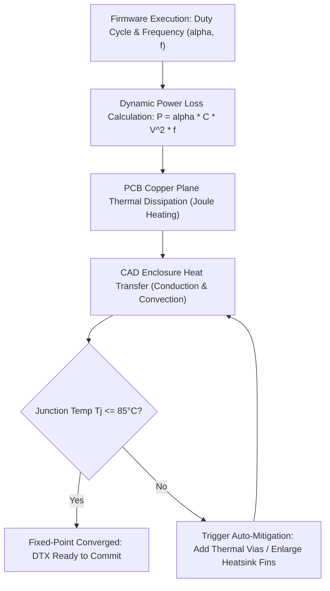

# Multi-Physics Co-Simulation & Relaxation Specification

This document specifies the electro-thermal-mechanical co-simulation loop and the digital-analog SPICE bridge implemented in [`crates/cross-domain-verifier`](file:///home/jrad/RustroverProjects/Oxide-Tech-Local-Agent/crates/cross-domain-verifier).

---

## 1. The Multi-Physics Fixed-Point Relaxation Loop

Real-world embedded systems cannot be validated in isolation: high-frequency firmware routines cause switching losses in power MOSFETs and MCUs; switching losses generate heat across PCB copper planes; heat builds up inside 3D CAD enclosures; and excessive enclosure temperatures trigger thermal throttling or silicon failure.

The `CoSimOrchestrator` unifies these domains into a closed-loop fixed-point relaxation algorithm:

---

## 2. Mathematical Formulations

### A. Dynamic & Static MCU Power Loss:
The power consumed by the microcontroller or switching stage is computed as:
$$P_{\text{total}} = P_{\text{static}} + \alpha \cdot C_{\text{load}} \cdot V_{DD}^2 \cdot f_{\text{clk}}$$
Where:
- $\alpha \in [0.0, 1.0]$: Switching activity factor (firmware duty cycle extracted from PWM / timer registers).
- $C_{\text{load}}$: Effective capacitive load on active output pins.
- $V_{DD}$: Core logic operating voltage (e.g. $3.3\text{V}$ or $1.8\text{V}$).
- $f_{\text{clk}}$: Active peripheral clock frequency.

### B. Thermal Dissipation & Silicon Junction Temperature ($T_j$):
The steady-state junction temperature of the silicon die is governed by:
$$T_j = T_{\text{ambient}} + P_{\text{total}} \cdot (\theta_{jc} + \theta_{cs} + \theta_{sa})$$
Where:
- $\theta_{jc}$: Junction-to-case thermal resistance ($^\circ\text{C/W}$).
- $\theta_{cs}$: Case-to-sink thermal resistance.
- $\theta_{sa}$: Sink-to-ambient thermal resistance of the CAD enclosure mesh.

### Material Thermal Conductivities ($k$):
- **Aluminum 6061**: $k = 167\text{ W/(m}\cdot\text{K)}$ (High dissipation).
- **PETG (3D Printed)**: $k = 0.20\text{ W/(m}\cdot\text{K)}$ (Thermal insulator).
- **ABS (Injection Molded)**: $k = 0.17\text{ W/(m}\cdot\text{K)}$.

---

## 3. Convergence & Auto-Mitigation Rules

1. **Silicon Temperature Ceiling**: The hard maximum junction temperature threshold is:
   $$T_j^{\text{max}} = 85.0^\circ\text{C}$$
2. **Mitigation Trigger**:
   - If $T_j > 85.0^\circ\text{C}$, the `cross-domain-verifier` sends an automated mutation command to `cad-forge` to expand the enclosure surface area or append passive heatsink fins.
   - Concurrently, `circuit-forge` receives a mutation to place a thermal via farm beneath the high-power component.
3. **Fixed-Point Iteration Cap**:
   - The relaxation loop runs for up to 5 iterations.
   - If $T_j$ cannot be reduced below $85^\circ\text{C}$ within 5 iterations, the transaction is rejected with `SimulationError::ThermalOverload` and the `DtxCoordinator` executes `rollback_dtx()`.

---

## 4. Digital-Analog MCU-to-SPICE Bridge (`mcu_spice_bridge`)

For mixed-signal hardware, digital firmware pin toggles are converted into continuous-time piecewise linear (PWL) voltage waveforms fed into SPICE analog circuits:
- **Hysteresis Logic**: Inputs passing through Schmitt triggers model finite high/low thresholds ($V_{IH} = 2.0\text{V}$, $V_{IL} = 0.8\text{V}$).
- **Rise/Fall Slew Rate**: Pin transitions model realistic GPIO drive strength (e.g., $t_r = t_f = 5\text{ns}$).
