# Oxide-Tech Local Agent OS: System Control Flow

This document details the step-by-step logic and runtime execution flows that govern Oxide-Tech Local Agent OS operations.

---

## 1. Multi-Agent AI Execution Flow (Auto-Healing Engine)

The core code generation cycle in `/api/agent/generate` executes in three structured phases, maintaining an automated verification loop:

### Phase 1: Planning (Chief Planner Agent)
1. **Context Extraction**: The gateway queries the `surrealdb-service` to retrieve the current parsed AST context tree of the repository.
2. **Analysis**: The workspace context is combined with the user prompt and sent to vLLM.
3. **Execution Plan Generation**: The Chief Planner returns a strict JSON-structured list of files to modify or create and a step-by-step instruction plan.

### Phase 2: Action (Execution Agent / Editor)
1. **Tool Invocation**: The Execution Agent parses the step-by-step instructions.
2. **Write or Diff**:
   - For new files: Generates the content and calls `write_file`.
   - For existing files: Produces an exact context search and replace block, calling `apply_diff`.
3. **Task Spawning**: Diffs and writes are spawned onto thread-safe blocking execution blocks using `spawn_blocking`.

### Phase 3: Verification & Auto-Healing (Verifier Agent)
1. **Compile Check**: The sandbox service spins up a Cargo Check inside a containerized sandbox to verify the modified code.
2. **Analysis on Failure**: If the compiler returns a non-zero exit code, the compilation error diagnostics (stderr) are fed to the Verifier Agent.
3. **Correction Mandate**: The Verifier drafts specific healing instructions.
4. **Correction Feedback**: The healing instructions are routed back to the Execution Agent, which modifies the diff blocks.
5. **Recursion Limit**: This verification loop continues for a maximum of **5 attempts**. If it compiles successfully within these attempts, the request returns `PASSED`; otherwise, it returns `FAILED` with diagnostics.

---

## 2. Database Integration & Vector Search Flow

```mermaid
graph TD
    %% Parsing and Indexing Flow
    subgraph Symbol Indexing
        Start[Trigger AST Parse] --> FileScan[Scan workspace for .rs files]
        FileScan --> TS[Tree-sitter Service: parse_file]
        TS --> Extract[Extract SymbolFields, Methods, Structs]
        Extract --> DBConn[Connect to SurrealDB v3]
        DBConn --> Save[Save to DB: Derive SurrealValue & RecordId]
    end
    
    %% Vector Search Flow
    subgraph Vector Retrieval
        Query[Search datasheet query] --> Embed[Get dense f32 vector from vLLM]
        Embed --> Qdrant[Qdrant Collection: SearchPoints]
        Qdrant --> Payload[Parse payloads for MCU specs & pins]
    end
```

### Database Persistence Rules
- All AST symbols and compilation records saved to SurrealDB must implement `surrealdb_types::SurrealValue`.
- ID parameters must use `RecordId::from_parts(namespace, table, id)`.

---

## 3. Sandbox Container Isolation Limits

Any execution run via the `sandbox` crate is isolated using the following system parameters:
- **Process Boundaries**: The sandbox runs tasks inside Docker containers using local image configs.
- **Resource Constraints**:
  - **Memory Limits**: Max memory footprint is restricted.
  - **CPU Pinning**: Execution threads are capped to prevent CPU starvation on the host gateway.
  - **Timeout Handler**: Process execution is terminated with a `SIGKILL` if it exceeds a 30-second duration limit.
- **Output Capturing**: Standard output and standard error are piped and structured as JSON data to prevent shell injection or raw terminal leakages.

---

## 4. Real-time Broadcasting Channel

The gateway streams compilation outputs and AI agent status transitions:
1. **Broadcaster Initialization**: A shared `WsBroadcaster` is wrapped in an `Arc` pointer and mounted to the Actix-web server state.
2. **Subscription**: Upon connecting to `/ws/compilation` or `/ws/agent-progress`, the socket retrieves a thread-safe `broadcast::Receiver`.
3. **Broadcasting Log Packets**:
   - Active cargo execution runs inside the sandbox forward log lines to the compilation channel.
   - The AI agent loop reports plan transitions (e.g. Chief Planner executing step 2) to the agent progress channel.
4. **Local Thread Safety**: Because websocket session handles are not `Send`, the event processor runs on Actix's local thread loop (`actix_web::rt::spawn`), aborting the reader loop if the user disconnects.
